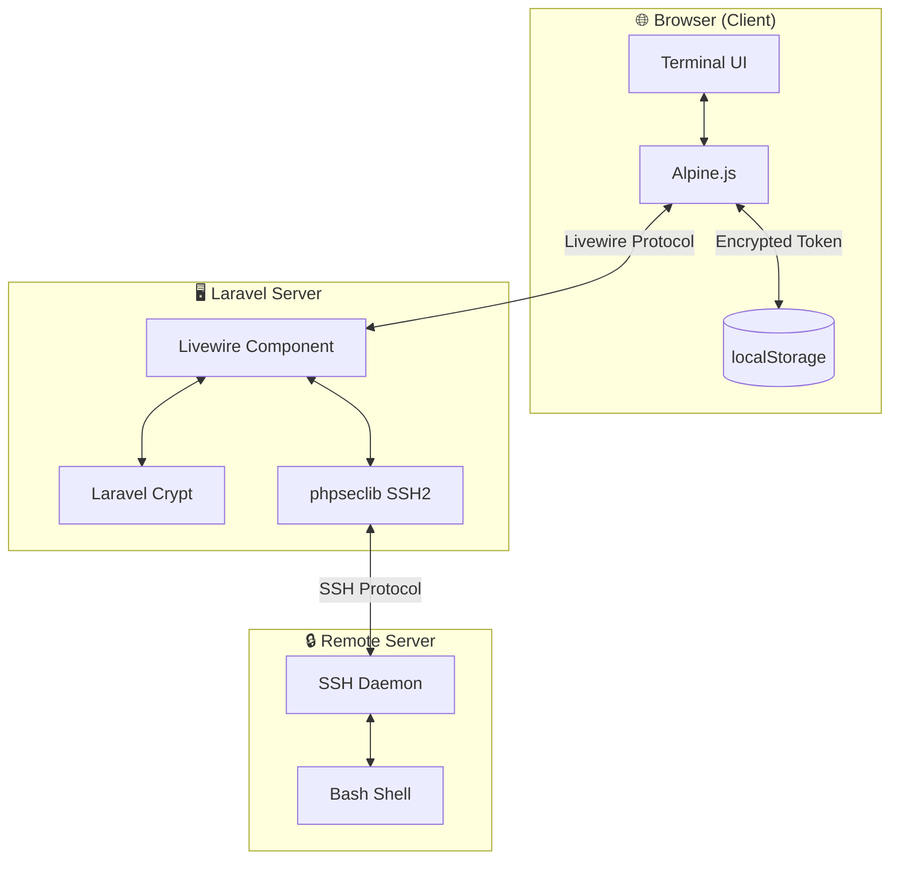
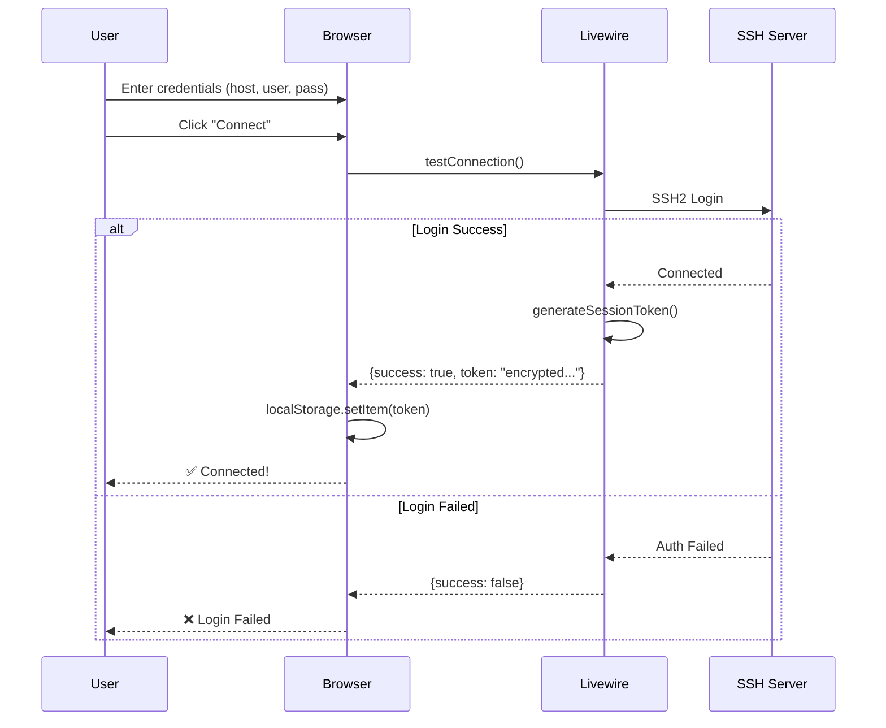
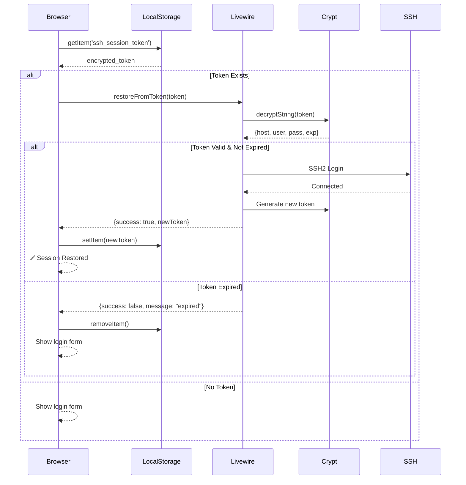
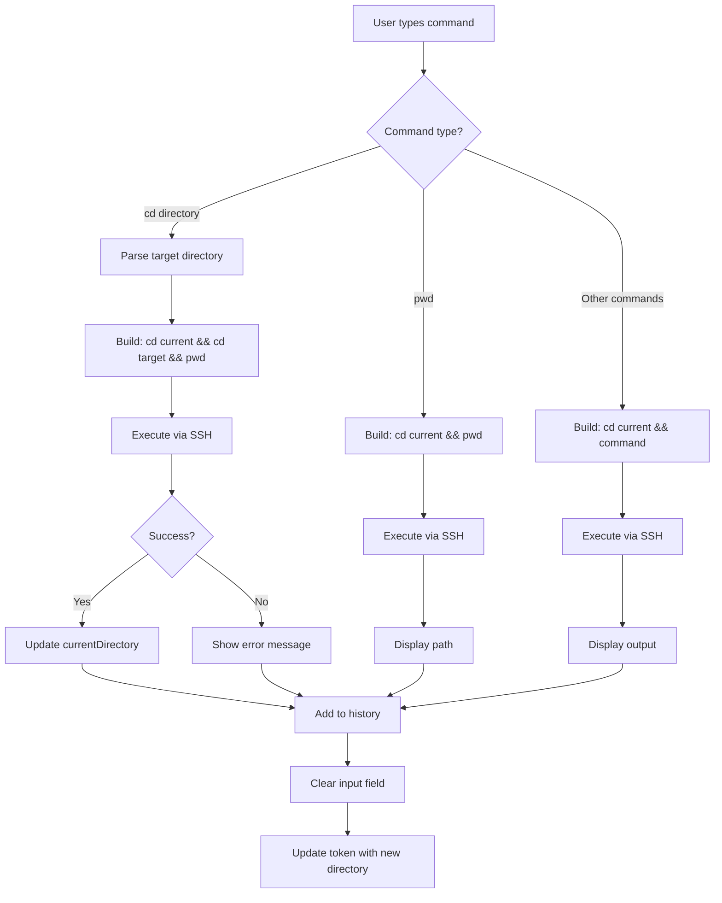
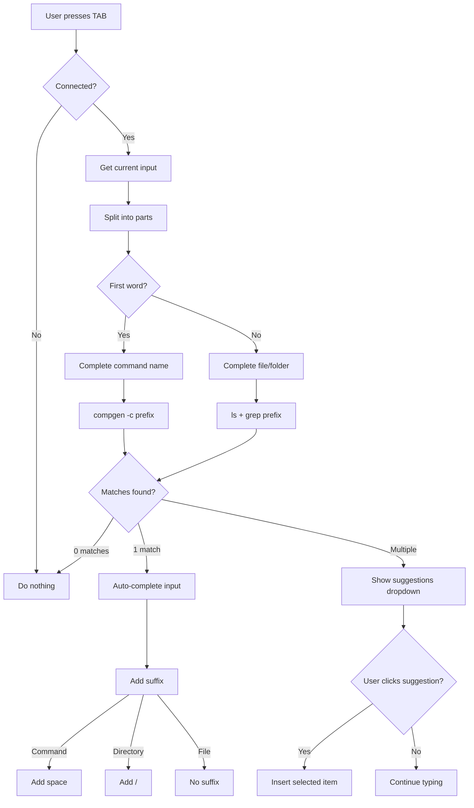
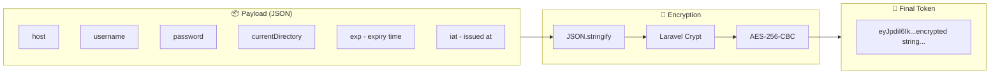
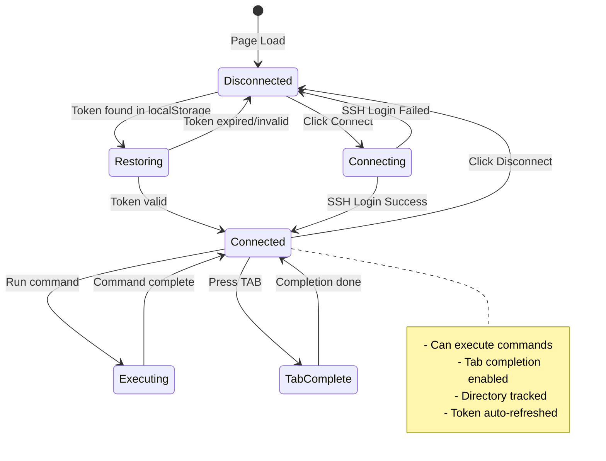
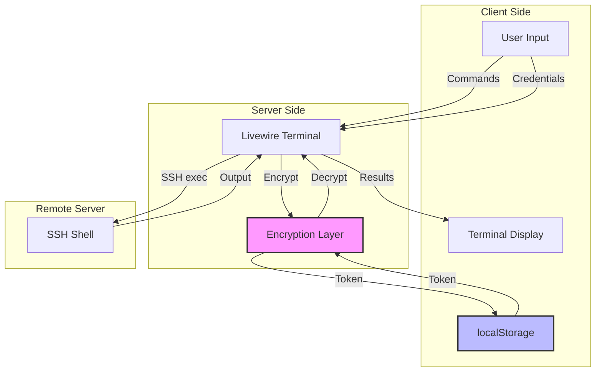

# Remote Terminal - Flow Diagram

## 1. Overall System Architecture

---

## 2. Connection Flow

---

## 3. Session Restore Flow (Page Refresh)

---

## 4. Command Execution Flow

---

## 5. Tab Completion Flow

---

## 6. Encrypted Token Structure

---

## 7. Component State Diagram

---

## 8. Data Flow Summary

---

## Legend

| Symbol | Meaning           |
| ------ | ----------------- |
| 🌐     | Browser/Client    |
| 🖥️     | Laravel Server    |
| 🔒     | Remote SSH Server |
| 📦     | Data Payload      |
| 🔐     | Encryption        |
| 🎫     | Token             |
| ✅     | Success           |
| ❌     | Failure           |
